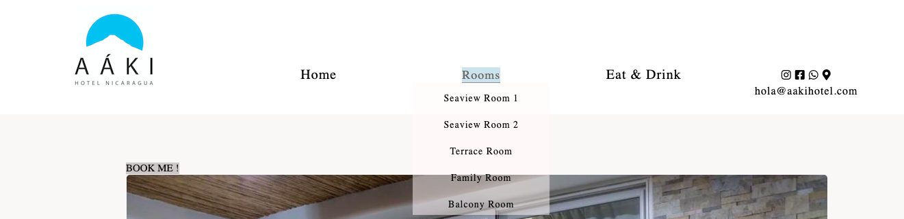
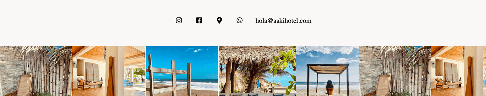

## Aáki Hotel 

 The Aáki Hotel website has been created with the purpose of operating as the website of Aáki Hotel. Located in the pacific coast of Nicaragua. The Hotel opened in 2017 and has been missing this website ever since. The main objective of this website is to offer travelers the oportunity to book a room at Aáki Hotel directly, avoinding any type of intermediaries. 

 

 ## UX 

### Aáki Hotel

* The hotel is a bouqitue that consists of nine rooms, a pool area, a bar and a restaurant. The hotel stands out from the rest in the area for the desing, the facilities, quality of its offer and its services. The website tries to keep a light tone in order to make it enjoyable for the users. There is information regarding what are the key points users are looking for while searching for a hotel. Considering some of theses points, I developed a very efficient page. 

### User Stories
* As a user I want to easily find general information about the hotel.
* As a user I want to easily find visual content that shows as much as possible about the facilities.
* As a user I want to easily find out more about the hotel through social media icons that take me to different social media content where I can learn more about the hotel. 
* As a user I want to easily contact through phone or email someone about booking a stay
* As the organisation we want to promote direct bookings avoiding intermediaries.
* As the organisation we want to promote our social media channels that offer almost infinite content.
* As the organisation we want to be able to tell a nice story about what the Aáki Hotel experience is all about.

 ## Features

 ### Common Features to all pages

 ### Navigation

 * The navigation bar features a common design across all pages displaying the logo on the left side and the navigation links on the center and right sides.
  * The navigation bar includes links on the logo, Home, Rooms, Eat & Drink, and linkable social media icons and email address. The various title links head to their respective pages for easy navigation. 
  * The navigation bar is fully responsive, for smaller screens, the format of the bar changes to a column orientation with the logo at the top centered on the page and the title links vertically aligned underneath. For tablets and screens in between there is a staggered change through the use of media queries in order to maximise its size.
  * An underline appears on the active page as a visual indicator to the user as to which page they are currently on. With a line appearing underneath the text on hover to visually indicate to users that they are clickable.

    

  * A dropdown menu appears when clicking on the Rooms link with the five different types of rooms the hotel offers. 

  
  

  ### Footer

  * Each page includes a common footer split into two sections. The top section contains social media icons with email address and the lower section contains a background photo that consists on a collage of photos of different areas of the hotel. 

    

 ### Home Page 

 * The Home Page image section introduces the hotel with a wide open image of the entrance where you can see through the building all the way to the ocean. Text overlays on the image with the meaning of the word Aáki. All together, this gives you a cozy feeling and a pretty good hint of what the experience could be like at Aáki Hotel.

  

 * The Core section, the feel good hotel, introduces our guests with a nice core values text that carefuly describes  what the hotel offers and what your experience would be like if someone were to visit the hotel. 

  

 * The Video introduces a powerful footage of the hotel edited with adventorous music. The video shows a girl experiencing every corner of the hotel. From the modern design at the entrance, to the beach front experience, to the Seaview with balcony room, to the pool area. It also shows her enjoying some of the food and beverage the hotel offers. This video transmits a lot of the Aáki Hotel experience. 

 * Get Here iframe shows a google maps that will clearly show where the hotel is located. Instructions on how to get there is one of the most important questions guests have, so considering this I added a map on the main page due to its importance.   
  
 
 ###  Rooms Pages 

* The Rooms option on the menu will dropdown a list with the different room types Aáki Hotel offers. Every room page shows two to three high quality images from that specific room type. 

#### Seaview Room Page
#### Seaview Room 2 Page 
#### Terrace Room Page 
#### Family Room Page 
#### Balcony Room Page

### Common features in the Room´s pages

### Book Me clickable

* Above, on the top left of every first image in every Room´s page, there is a Book Me button that will direct the user to a book form. This form is a basic form that in the future will be adjusted with proper JavScript and linked to a real booking system. 

 #### Amenities section

 * Every Room page offers two unordered lists that contain general information as well as the amenities the rooms offer. They are contained in a section with a bacground image that projects in black and white the hotel from the front side. 

  

 ### Book Me Page

 * The Book Me form section contains a form where the guests can book their stay. It requires a name, an email address, a room type, a dates and amount of guests options. 

 * At the bottom of the form there is a Confirm Booking button that will take you to the thank you page. Eventually, with Java Script, the for will be replaced with a proper booking system and linked to the hotel´s reservations channel manager. 

 * The form section has a background image  of a palm tree and an elegant architectural design that combines wood and nature. 

 

### Thank You Page 

* This page contains a pretty straight forward Thank You section that shows every time a guest submits a booking in the Book Me page. This message thanks the guests for their booking and tells them that a confirmation email has been sent to the email account that has been provided. 

### Eat and Drink

* This page shows very graphic footage of the quality of the food and drinks products served at Aáki Hotel. It also contains a concept note describing where the menu takes its inspiration from. Food and Beverage represents a big part of the sales at the business, so it was very important to show a lot of what it´s offered at the hotel. 

* On the lower part of this page, there is a Welcome header message together with a photo of the staff at Aáki Hotel. 

### Features Left to Implement

* A Things to Do page will be added in the future with some direct booking links to all the different activites that the guests can do when they are staying at Aáki Hotel. 
* A Serch option.
* A proper form with JavaScript.
* Sliding images at the main image section. Instead of having one image, I would like to see a slide of 4 different images
* A small booking form overflowing on the main image at the Home Page.

### Testing

For this sites testing, I took a very close approach of trial and error to every feature in every page. I developed the different features making sure they all made sense together in an holistic way. I wanted to keep the functionality very clean and very straight forward. I tested different options regarding the header menu and its resposiveness. Visualizing what was the right combination of practicity and cleanliness. I constantly adjusted the seizes and changed from floats to flex-box for a better organization of my menu items. 

One of my main concerns has been the rooms dropdown menu that over flows over the images. In order to keep the images visible I added some transparency to the dropdown which results, in my opinion, in a clean and cool feature, specially when the width goes under 1050px and the menu transforms into a column. 

I constantly used Chromes developer tools to try different options and make the right adjustments. I believe hotel web pages should have a large amount of visual content, from facilities, to food and beverage; this is why this web contains a lot of images that were reseized and adjusted to be visually attractive on responsive design as well as on a wider screen. 

Testing was performed with the following devices/browsers:
  * MacBook Air computer: 1280 x 800 
    * Google Chrome
    * Firefox
    * Microsoft Edge
    * Kindle Fire HDX: 800 x 1200
  * iPad Air: 1536 x 2048 display
    * iOS Safari
  * iPhone 11 x pro: 414 x 896 display
    * iOS Safari

I also tested the site with the Chrome and Firefox developer tools to simulate the display on other devices and test the responsiveness of the site.

### Validator Testing

* HTML 

* No errors returned when passing through the official W3C Validator.

* Index.html 
* Seaview1.html 
* Seaview2.html 
* Terrace.html 
* Balcony.html 
* Family.html 
* Bookme.html 
* Thankyou.html 
* Eatanddrink.html 

* CSS 

* Style.css 

# Lighthouse

* I have used the developer tools lighthouse option to create reports to measure different indicators for both mobile and desktop. 
* For the desktop report, the performance score was of 59 as a result of very heavy images. I used the Tiny PNG compressor tool to compress the images. 
* For the mobile report I had a low score as well in the performance and I tried a few tests incognito and the results came similar to the desktop results. 

  ## Deployment 
 
* The site was deployed to GitHub pages. the steps to deploy are as follows: 

  * In the GitHub repository, navigate to the settings tab
  * Under the GitHub Pages from the source section drop-down menu, select the master branch 
  * Once the master branch has been selected, the page will be automatically refreshed with a detailed ribbon display to indicate the successful deployment. 

  The live link can be found here - https://danpr1984.github.io/Danpr-Aaki-Hotel-1st-project/

  ## Credits

  ### Content
    
    * As owner of the existing Áaki Hotel, I developed the content of this page following a design line decided by myself. 
    * The text was all written by myself and I took the general information and amenities text from https://www.booking.com/hotel/ni/aaki.es.html?aid=318615;label=English_Sweden_EN_SE_29561953825-X1XV3iL57zIMOHyouN4KkgS217247017863%3Apl%3Ata%3Ap1%3Ap2%3Aac%3Aap%3Aneg%3Afi22761050535%3Atidsa-331215073644%3Alp9062460%3Ali%3Adec%3Adm;sid=f9b1c3427c3da2c411a0b3c87ad4b725;dest_id=-1112872;dest_type=city;dist=0;group_adults=2;group_children=0;hapos=0;hpos=0;no_rooms=1;req_adults=2;req_children=0;room1=A%2CA;sb_price_type=total;sr_order=popularity;srepoch=1638378305;srpvid=341c7820463f0114;type=total;ucfs=1&#hotelTmpl
    * Instructions on how to implement a form were taken from The Love Running project from CODE INSTITUTE.
    * Instructions on how to use felx-box were taken from https://mattbcoding.github.io/ci-webinar-positioning-flex/flex.html. and from Kevin Powell´s https://www.youtube.com/watch?v=R7gqJkdc5dM&t=1329s&ab_channel=KevinPowell
    * Instructions on how to write the README.md were taken from https://docs.github.com/en/github/writing-on-github/getting-started-with-writing-and-formatting-on-github/basic-writing-and-formatting-syntax and from https://github.com/MattBCoding/leinster-trophy
    * The icons used for the logo, bookmark link, download button and in the footer were taken from [Font Awesome](https://fontawesome.com/)

### Media

*   All of the media images, the video and the logo used in this site belongs to Aáki Hotel which is of my property so I am entitled to use them. 
* The iframed map in the Get-Here section belongs to Google Maps.

    

 
  
